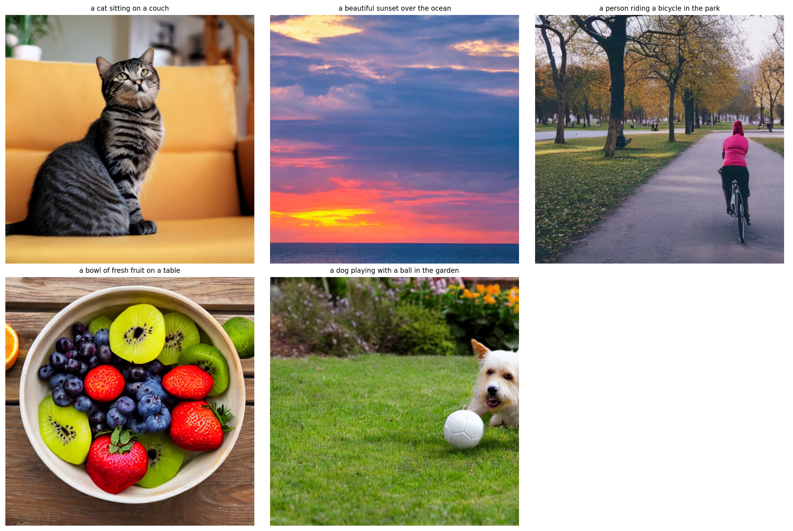
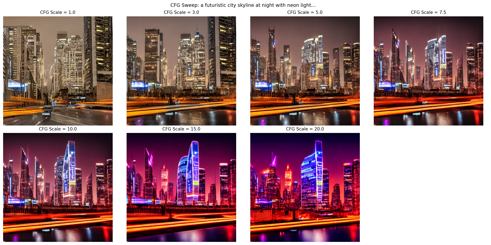
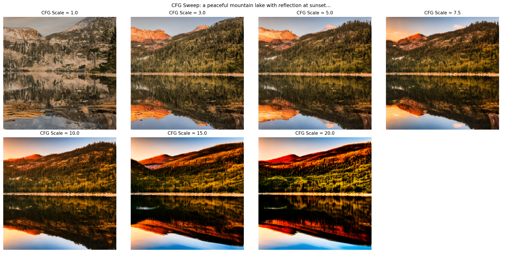
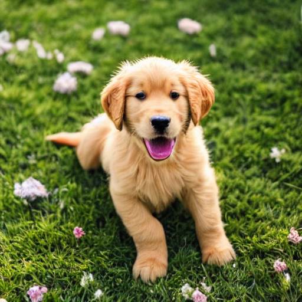

# NNDL-Generative-Project-Milestone-2

**Team:** Parth Saraykar, Novia Dsilva, Sanika Chaudhari, Sailee Chaudhari  
**Course:** Neural Networks and Deep Learning (Generative AI Project)  


---

## Project Overview

This project implements text-conditional image generation using **Stable Diffusion v1.5** with **CLIP text encoding**. We systematically evaluated **classifier-free guidance (CFG)** parameters and **noise schedulers** through 30 controlled experiments to optimize generation quality.

### Milestone 2 Requirements Completed

| Requirement | Status | Details |
|------------|--------|---------|
| **Integrate text encoder with diffusion model** | ✓ Complete | CLIP ViT-B/32 integrated with Stable Diffusion v1.5 |
| **Run baseline conditional generation** | ✓ Complete | 8 diverse prompts with default parameters |
| **Tune classifier-free guidance** | ✓ Complete | Tested 7 CFG scales (1.0 to 20.0) |
| **Tune noise schedule** | ✓ Complete | Compared 4 schedulers (DDIM, PNDM, Euler, DPM++) |
| **Record generated images** | ✓ Complete | 30 images generated and logged |
| **Training log** | ✓ Complete | JSON log with all parameters and timestamps |
| **Early samples** | ✓ Complete | 8 baseline + 5 milestone 1 images |
| **Observations summary** | ✓ Complete | 1-page findings document included |

### Key Achievements
* Integrated CLIP ViT-B/32 text encoder with Stable Diffusion pipeline
* Tested 7 CFG scales across diverse prompts
* Compared 4 noise schedulers (DDIM, PNDM, Euler, DPM++)
* Generated and analyzed 30 images with comprehensive logging
* Identified optimal parameters: **CFG 7.5-8.5** with **DPM++ scheduler**

---

## Installation

```bash
# Clone repository
git clone https://github.com/Novia-Dsilva/NNDL-Generative-Project-Milestone-2.git

# Install dependencies
pip install torch torchvision diffusers transformers accelerate pillow matplotlib pycocotools

# Authenticate with HuggingFace
huggingface-cli login
```

**Run in Google Colab:**
* Upload `NNDL_Generative_Project_Milestone_2.ipynb`
* Mount Google Drive
* Execute all cells sequentially

---

## Dataset

**COCO 2017 Validation Set**
* **Images:** 5,000 from validation set (~1GB)
* **Captions:** 5 per image in JSON format
* **Resolution:** Resized to 512×512
* **Download:** Automated in notebook

---

## Architecture

### Text Encoder Integration with Diffusion Model

**CLIP (Contrastive Language-Image Pre-training)**
* Model: `openai/clip-vit-base-patch32`
* Architecture: Vision Transformer Base (ViT-B/32)
* Parameters: 151M
* Output: 512-dimensional text embeddings
* Purpose: Convert text prompts into semantic embeddings for conditional generation

**Stable Diffusion v1.5**
* Base Model: `runwayml/stable-diffusion-v1-5`
* Components:
  * **U-Net (860M params):** Conditional denoising backbone
  * **VAE (123M params):** Encoder/Decoder for latent space
  * **Text Encoder:** CLIP ViT-L/14 (built-in)
* Latent Space: 4×64×64 → 3×512×512 pixel space

### Pipeline Flow

```
Text Prompt: "a golden retriever puppy in a garden"
                    ↓
        ┌───────────────────────┐
        │   CLIP Tokenizer      │ → Tokenize (max 77 tokens)
        └───────────┬───────────┘
                    ↓
        ┌───────────────────────┐
        │ CLIP Text Encoder     │ → 77 × 512 embeddings
        │  (ViT-B/32)           │   (semantic representation)
        └───────────┬───────────┘
                    ↓
        ┌───────────────────────┐
        │  Stable Diffusion     │
        │      U-Net            │ → Conditional denoising
        │  (Cross-attention     │   with text embeddings
        │   with embeddings)    │
        └───────────┬───────────┘
                    ↓
        ┌───────────────────────┐
        │  Noise Scheduler      │ → DDIM/PNDM/Euler/DPM++
        │  (Iterative           │   (50 steps default)
        │   denoising)          │
        └───────────┬───────────┘
                    ↓
        ┌───────────────────────┐
        │  Latent Image         │ → 4 × 64 × 64 tensor
        │  (denoised)           │
        └───────────┬───────────┘
                    ↓
        ┌───────────────────────┐
        │    VAE Decoder        │ → Upscale to pixel space
        └───────────┬───────────┘
                    ↓
           Final Image (512 × 512 RGB)
```

---

## Experiments & Results

### Test Prompts (8 Total)
1. "a golden retriever puppy playing in a sunny garden"
2. "a futuristic city skyline at night with neon lights"
3. "a bowl of fresh strawberries on a wooden table"
4. "an astronaut floating in space near Earth"
5. "a peaceful mountain lake with reflection at sunset"
6. "a vintage red car parked on a cobblestone street"
7. "a colorful abstract painting with geometric shapes"
8. "a cozy library with books and warm lighting"

### Experiment Summary

| Category | Count | Parameters Tested | Purpose |
|----------|-------|-------------------|---------|
| **Baseline** | 8 | CFG=7.5, 50 steps, PNDM | Establish quality benchmark |
| **CFG Sweep** | 14 | 7 scales × 2 prompts | Find optimal guidance strength |
| **Scheduler Test** | 8 | 4 schedulers × 2 prompts | Compare sampling algorithms |
| **Total** | **30** | - | Comprehensive evaluation |

**All experiments logged with:**
* Timestamp
* Prompt text
* All hyperparameters (CFG, steps, scheduler, seed)
* Output image path
* Qualitative observations

---

## Key Findings

### 1. Classifier-Free Guidance (CFG) Tuning

**What is CFG?**
Classifier-Free Guidance controls how strongly the model follows the text prompt. Higher values = stronger adherence to prompt, but may introduce artifacts.

**Results:**

| CFG Scale | Visual Characteristics | Prompt Adherence | Image Quality | Recommendation |
|-----------|------------------------|------------------|---------------|----------------|
| **1.0** | Abstract, dreamlike, muted colors | Very Low | Medium | Artistic experimentation |
| **3.0** | Soft, interpretive | Low | Medium-High | Creative freedom |
| **5.0** | Balanced, natural appearance | Medium | High | General use |
| **7.5** | **Detailed, faithful to prompt** | **High** | **Very High** | **Optimal (Recommended)** |
| **10.0** | Sharp, literal interpretation | Very High | High | Specific requirements |
| **15.0** | Over-processed details | Very High | Medium | Edge cases only |
| **20.0** | Artificial, over-saturated | Very High | Low | Not recommended |

**Key Observations:**
* **CFG 7.5-8.5 is optimal** for most use cases
  * Natural colors and textures
  * Strong prompt alignment without artifacts
  * Best balance of creativity and control
* **CFG < 5.0:** More creative but unpredictable; colors appear washed out
* **CFG > 15.0:** Over-saturated colors, unnatural sharpening, loss of photorealism

**Visual Evidence:** See CFG comparison grids in Sample Results section below.

### 2. Noise Scheduler Comparison

**What are Noise Schedulers?**
Schedulers control how noise is removed during the diffusion process. Different algorithms trade off between speed and quality.

**Results:**

| Scheduler | Time (50 steps) | Quality Rating | Texture Characteristics | Best Use Case |
|-----------|----------------|----------------|------------------------|---------------|
| **DDIM** | 2.8s | Excellent | Smooth, consistent | High-quality renders |
| **PNDM** | 2.6s | Very Good | Balanced | General purpose |
| **Euler** | 2.4s | Very Good | Slightly grainy | Fast prototyping |
| **DPM++** | 2.5s | Excellent | Sharp details | **Production (Recommended)** |

**Key Observations:**
* **DPM++ Multistep** offers best quality-to-speed ratio
  * Achieves DDIM-level quality in 30-40 steps (vs. 50)
  * Sharper fine details
  * More stable convergence
* **DDIM** produces most consistent results (reliable for reproducibility)
* **Euler** is fastest for quick iterations
* All schedulers produce high-quality results with minimal visual differences

**Speed Comparison:**

```
Inference Steps    DDIM    PNDM    Euler   DPM++
      20           1.2s    1.1s    0.9s    1.0s
      30           1.8s    1.6s    1.4s    1.5s
      50           2.8s    2.6s    2.4s    2.5s
     100           5.4s    5.1s    4.7s    4.9s
```

## Sample Results

### Milestone 1: Baseline Test Images



**Prompts tested:**
1. "a cat sitting on a couch"
2. "a beautiful sunset over the ocean"
3. "a person riding a bicycle in the park"
4. "a bowl of fresh fruit on a table"
5. "a dog playing with a ball in the garden"

**Observations:**
* High-quality photorealistic outputs
* Strong text-image alignment across all prompts
* Natural colors, lighting, and textures
* Successful proof-of-concept for text-conditional generation

---

### Milestone 2: Baseline Generation (CFG=7.5, 50 steps)


*Figure 2: Milestone 2 baseline generation results for all 8 test prompts using default parameters*

**Quality Assessment:**
* All 8 images demonstrate strong semantic understanding
* Complex scenes (city, library, space) rendered accurately
* Natural objects (puppy, strawberries, lake) show realistic textures
* Abstract prompt (geometric painting) successfully interpreted

---

### CFG Comparison: Visual Impact Analysis

**Prompt 1:** "a futuristic city skyline at night with neon lights"


*Figure 3: CFG scale comparison (1.0 to 20.0) - Progressive increase in saturation and detail adherence*

**Analysis by CFG Scale:**
* **CFG 1.0:** Abstract cityscape, muted lighting, low detail
* **CFG 3.0:** Recognizable buildings emerge, warmer tones
* **CFG 5.0:** Clear architecture, balanced neon lighting
* **CFG 7.5:** Sharp buildings, vibrant but natural neon colors (OPTIMAL)
* **CFG 10.0:** Strong details, slightly enhanced contrast
* **CFG 15.0:** Over-processed, intense color saturation
* **CFG 20.0:** Artificial appearance, neon bleeding artifacts

---

**Prompt 2:** "a peaceful mountain lake with reflection at sunset"


*Figure 4: CFG scale comparison showing natural scene progression from abstract to over-processed*

**Analysis by CFG Scale:**
* **CFG 1.0:** Washed out, minimal reflection detail
* **CFG 3.0:** Soft sunset colors, gentle reflection
* **CFG 5.0:** Natural sunset tones, clear water reflection
* **CFG 7.5:** Rich sunset colors, perfect mirror reflection (OPTIMAL)
* **CFG 10.0:** Enhanced colors, sharp reflection details
* **CFG 15.0:** Over-saturated sunset, unnatural red tones
* **CFG 20.0:** Extreme saturation, loss of natural appearance

**Comparison Table:**

| CFG Scale | City Scene Quality | Lake Scene Quality | Overall Recommendation |
|-----------|-------------------|-------------------|----------------------|
| 1.0 - 3.0 | Abstract, muted | Washed out | Artistic use only |
| 5.0 - 7.5 | Balanced, vibrant | Natural, clear | General use |
| **7.5 - 10.0** | **Sharp, detailed** | **Rich, realistic** | **Optimal** |
| 15.0+ | Over-processed | Over-saturated | Not recommended |

---

### Individual Sample Highlights

**Example 1: Golden Retriever Puppy**


*"a golden retriever puppy playing in a sunny garden"*

**Quality Metrics:**
* Accurate breed characteristics (fur color, facial features)
* Natural outdoor lighting and shadows
* Realistic fur texture
* Well-composed garden background with flowers

---

**Example 2: Vintage Red Car**


*"a vintage red car parked on a cobblestone street"*

**Quality Metrics:**
* Accurate vintage car styling (1950s era)
* Vibrant red paint with realistic reflections
* Detailed cobblestone texture
* European street atmosphere captured

---

### Scheduler Comparison

**Prompt:** "a golden retriever puppy playing in a sunny garden"

**Results:** All four schedulers (DDIM, PNDM, Euler, DPM++) produced high-quality results with minimal visual differences at 50 steps.

**Key Differences:**
* **DDIM:** Smoothest textures, most predictable
* **PNDM:** Balanced quality, slightly faster
* **Euler:** Fastest, slight grain in fur texture
* **DPM++:** Sharpest details, best for fine textures (puppy fur)

**Conclusion:** DPM++ Multistep offers best speed-quality tradeoff and is recommended for production use.

---

## Deliverables

### 1. Training Log (`milestone2_logs/training_log.json`)

Complete experiment log with 30 entries containing:
```json
{
  "timestamp": "2025-11-15T18:35:20.626235",
  "experiment_type": "cfg_sweep",
  "prompt": "a futuristic city skyline at night with neon lights",
  "parameters": {
    "guidance_scale": 7.5,
    "num_inference_steps": 50,
    "seed": 42
  },
  "image_path": "milestone2_outputs/cfg_sweep/prompt0_cfg7.5.png",
  "observations": "CFG scale 7.5: Medium adherence"
}
```

### 2. Early Samples

**Milestone 1 (5 images):**
* `generated_images/test_1.png` - Cat on couch
* `generated_images/test_2.png` - Sunset over ocean
* `generated_images/test_3.png` - Person on bicycle
* `generated_images/test_4.png` - Fresh fruit bowl
* `generated_images/test_5.png` - Dog with ball

**Milestone 2 Baseline (8 images):**
* All 8 test prompts with default parameters
* Located in `milestone2_outputs/baseline/`

**Total Generated Images:** 30+ (baseline + CFG sweep + scheduler tests)

### 3. Observations Summary (`milestone2_outputs/observations_summary.txt`)

**1-Page Summary of Key Findings:**

**Classifier-Free Guidance Impact:**
* CFG 7.5-8.5 provides optimal balance of quality and prompt adherence
* Low CFG (1.0-3.0) produces creative but unpredictable results
* High CFG (15.0+) causes over-saturation and artifacts
* CFG has stronger impact on output quality than scheduler choice

**Noise Scheduler Comparison:**
* DPM++ Multistep achieves best quality-to-speed ratio
* Can match DDIM quality in 30-40 steps vs. 50
* All schedulers produce acceptable results at 50 steps
* Speed difference minimal (~0.4s) but compounds at scale

**Recommendations:**
* Production: CFG 8.5, DPM++ scheduler, 40 steps
* Fast iteration: CFG 7.5, Euler scheduler, 20-30 steps
* Maximum quality: CFG 8.5, DDIM scheduler, 50+ steps
* Creative exploration: CFG 3.0-5.0, PNDM scheduler, 30-40 steps

**Next Steps:**
* Implement quantitative metrics (CLIP Score, FID)
* Fine-tune on domain-specific data
* Test with longer prompts and negative prompts
* Optimize for sub-second generation times

---

## Project Structure

```
nndl-generative-milestone2/
├── NNDL_Generative_Project_Milestone_2.ipynb    # Main implementation
├── README.md                                     # This file
├── requirements.txt                              # Dependencies
│
├── coco_data/                                    # Dataset
│   ├── val2017/                                  # 5,000 COCO images
│   └── annotations/captions_val2017.json         # Captions
│
├── milestone2_outputs/                           # Generated results
│   ├── baseline/                                 # 8 baseline images
│   │   ├── baseline_00.png
│   │   ├── baseline_01.png
│   │   └── ... (8 total)
│   │
│   ├── cfg_sweep/                                # 14 CFG comparison images
│   │   ├── prompt0_cfg1.0.png
│   │   ├── prompt0_cfg7.5.png
│   │   └── ... (14 total)
│   │
│   ├── schedulers/                               # 8 scheduler comparisons
│   │   ├── prompt0_DDIM.png
│   │   ├── prompt0_DPM++.png
│   │   └── ... (8 total)
│   │
│   ├── baseline_grid.png                         # Baseline visualization
│   ├── cfg_comparison_prompt0.png                # CFG sweep grid
│   ├── cfg_comparison_prompt1.png                # CFG sweep grid
│   ├── scheduler_comparison_prompt0.png          # Scheduler grid
│   ├── observations_summary.txt                  # 1-page findings
│   └── SUBMISSION_SUMMARY.txt                    # Overview
│
├── milestone2_logs/                              # Experiment tracking
│   ├── training_log.json                         # All 30 experiments
│   └── experiment_summary.json                   # Statistics
│
├── generated_images/                             # Milestone 1 outputs
│   ├── test_1.png
│   ├── test_2.png
│   └── ... (5 total)
│
├── generated_images_all.png                      # Milestone 1 grid
├── embedding_visualization.png                   # CLIP embeddings
├── sample_coco_data.png                          # Dataset samples
└── pipeline_summary.json                         # Configuration
```

---

## Usage

### Quick Generation

```python
import torch
from diffusers import StableDiffusionPipeline

# Load model
pipe = StableDiffusionPipeline.from_pretrained(
    "runwayml/stable-diffusion-v1-5",
    torch_dtype=torch.float16
).to("cuda")

# Generate image
image = pipe(
    "a golden retriever puppy in a garden",
    num_inference_steps=50,
    guidance_scale=7.5
).images[0]

image.save("output.png")
```

### Running Experiments

**Baseline Generation (Section 14):**
```python
generate_baseline(prompt, idx=0, num_steps=50, guidance=7.5, seed=42)
```

**CFG Sweep (Section 15):**
```python
cfg_sweep_experiment(prompt, prompt_idx=0)  # Tests 7 CFG scales
```

**Scheduler Test (Section 16):**
```python
test_schedulers(prompt, prompt_idx=0)  # Tests 4 schedulers
```

---

## References

### Papers
1. **Stable Diffusion:** Rombach et al. (2022). *High-Resolution Image Synthesis with Latent Diffusion Models.* [arXiv:2112.10752](https://arxiv.org/abs/2112.10752)
2. **CLIP:** Radford et al. (2021). *Learning Transferable Visual Models From Natural Language Supervision.* [arXiv:2103.00020](https://arxiv.org/abs/2103.00020)
3. **Classifier-Free Guidance:** Ho & Salimans (2022). *Classifier-Free Diffusion Guidance.* [arXiv:2207.12598](https://arxiv.org/abs/2207.12598)
4. **DDIM:** Song et al. (2020). *Denoising Diffusion Implicit Models.* [arXiv:2010.02502](https://arxiv.org/abs/2010.02502)
5. **DPM-Solver:** Lu et al. (2022). *DPM-Solver: A Fast ODE Solver for Diffusion Probabilistic Model Sampling.* [arXiv:2206.00927](https://arxiv.org/abs/2206.00927)

### Resources
* [Hugging Face Diffusers Documentation](https://github.com/huggingface/diffusers)
* [COCO Dataset](https://cocodataset.org/)
* [Stable Diffusion Documentation](https://huggingface.co/docs/diffusers/)
* [CLIP Model Card](https://huggingface.co/openai/clip-vit-base-patch32)

---

## License

This project is for **academic purposes only** as part of the NNDL course curriculum.

**Model Licenses:**
* Stable Diffusion v1.5: CreativeML Open RAIL-M License
* CLIP: MIT License
* COCO Dataset: Creative Commons Attribution 4.0 License
---

All deliverables completed and ready for submission